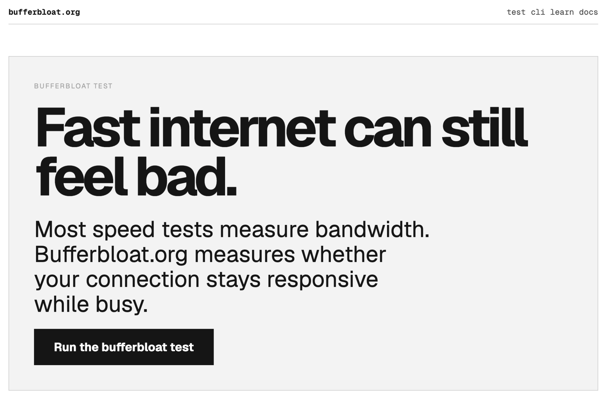

# bufferbloat.org

Open-source browser-based bufferbloat test for measuring internet responsiveness under load.

Most speed tests measure bandwidth. bufferbloat.org measures whether your connection stays responsive while downloads and uploads are active.

https://bufferbloat.org

## What is bufferbloat?

Bufferbloat is excessive latency caused by overloaded network queues.

A connection can show high download speed and still feel bad if latency spikes while the connection is busy. That is why video calls freeze, games lag, pages stall, and remote work feels unstable even when a normal speed test looks fine.

bufferbloat.org focuses on responsiveness, not just raw throughput.

## Open-source internet utility

bufferbloat.org is open source because internet quality diagnostics should be transparent, inspectable, and easy to improve.

The project is designed to be different from opaque commercial speed tests:

- no ad-driven funnel
- no fake precision
- no unnecessary tracking pressure
- browser-native testing
- visible methodology
- clear responsiveness-focused results
- community-friendly codebase

The goal is to help people understand how their connection behaves under load.

## Live test interface

## What the test measures

The browser runs three phases:

1. Quiet-line latency
2. Download latency under load
3. Upload latency under load

The result includes:

- median quiet ping latency
- median download-stress latency
- median upload-stress latency
- download throughput
- upload throughput
- responsiveness grade
- plain-language diagnosis

## Why responsiveness matters

Bandwidth tells you how much data can move through a connection.

Responsiveness tells you whether the connection still reacts quickly while busy.

For everyday internet use, responsiveness often matters more than peak speed for:
- video calls
- online games
- browsing
- remote work
- streaming while other devices are active

## Features

- Browser-based bufferbloat test
- Latency-under-load measurement
- Download and upload stress phases
- Median-based ping reporting
- Real-time instrumentation UI
- Mobile-friendly design
- Light and dark mode support
- Open-source codebase

## Local development

Install dependencies:

npm install

Run the development server:

npm run dev

Then open:

http://localhost:3000

Build for production:

npm run build

## Tech stack

- Next.js App Router
- TypeScript
- Vercel
- Cloudflare

## Contributing

Contributions are welcome.

Areas especially worth improving:
- measurement methodology
- browser compatibility
- accessibility
- documentation
- mobile responsiveness
- privacy-preserving diagnostics

## Privacy

The core test runs entirely in the browser.

Optional email signup storage should never be committed:

data/signups.json

## License

See LICENSE.
