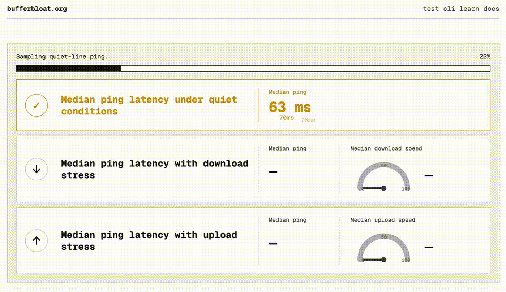

# bufferbloat.org

An open-source bufferbloat test dedicated to measuring internet reliability.

Most internet speed tests measure **throughput**: how many megabits per second your connection can deliver. Bufferbloat.org measures something different: how reliable your connection remains while it is under load.

**Website:** https://bufferbloat.org

---

## Why this exists

Bufferbloat.org exists because speed tests leave an important question unanswered:

> **"Why is my internet still laggy if I have 500 Mbps?"**

A connection can deliver hundreds of megabits per second while video calls freeze, games stutter, websites hesitate and remote desktops become frustrating to use. The problem is often not bandwidth, but **latency under load**: how much latency increases while the connection is busy.

This repository provides an open, browser-based implementation of that measurement. The longer project story is on the [mission page](https://bufferbloat.org/mission).

---

## What is bufferbloat?

Bufferbloat is excessive latency caused by oversized or overloaded network queues.

When a connection becomes busy, packets can spend too long waiting before being transmitted. Throughput may remain high while reliability deteriorates dramatically.

That's why a connection can achieve an excellent speed test result and still perform poorly during video calls, online gaming, browsing or other interactive applications.

This project focuses on measuring **internet reliability under load**, not just throughput.

---

## Why open source?

Internet measurement should be transparent. Measurements should be reproducible. Methodology should be public. Implementation should never be a black box.

The project provides:

- Open measurement methodology
- Inspectable source code
- Browser-based testing
- Privacy-first design
- Reproducible measurements
- Community-driven development

---

## Live test



---

## What the test measures

The browser test starts with a short warm-up, then records three scored
measurement phases:

1. Quiet-line latency
2. Download latency under load
3. Upload latency under load

Results include:

- Median idle latency
- Median download latency under load
- Median upload latency under load
- Download throughput
- Upload throughput
- Overall bufferbloat grade
- Plain-language diagnosis
- Structured technical details
- CSV export of the measurement record

The result grade is primarily about latency stability under load. Throughput is
reported because it matters for real applications, but low bandwidth by itself
is not treated as bufferbloat.

---

## Why reliability matters

Throughput tells you **how much** data your connection can move.

Internet reliability tells you **whether** your connection continues to react quickly while moving that data.

For many everyday applications, reliability under load has a greater impact on user experience than peak bandwidth.

Examples include:

- Video conferencing
- Online gaming
- Web browsing
- Remote desktop
- Voice calls
- Cloud development
- Streaming while other devices are active

---

## Features

- Browser-based bufferbloat measurement
- Open-source measurement engine
- Download and upload stress testing
- Median latency reporting
- Real-time visualisation
- Mobile-friendly interface
- Consistent light interface
- Public measurement methodology

---

## Local development

Install dependencies:

```bash
npm install
```

Run the development server:

```bash
npm run dev
```

Open:

```
http://localhost:3000
```

Build for production:

```bash
npm run build
```

---

## Technology

- Next.js App Router
- TypeScript
- Cloudflare
- Vercel

---

## Contributing

Contributions are welcome.

Areas of particular interest include:

- Measurement methodology
- Browser compatibility
- Accessibility
- Documentation
- Privacy-preserving diagnostics
- Visualisation and reporting

If you disagree with the methodology, find a bug, or have an idea for improving the measurements, please open an issue or submit a pull request.

---

## Privacy

The core measurement is orchestrated by the browser. Test traffic is generated
from the page against public measurement endpoints, and no local helper
application is required.

Bufferbloat.org stores first-party operational analytics for test quality and
shared result links: session/test events, success or failure, coarse location
from hosting headers, broad browser/OS/device category, bucketed viewport,
measured results, chart samples, and application-fit scores. It does not store
IP addresses, precise geolocation, full user-agent strings, or fingerprinting
signals.

Shared result pages are backed by the same completed-test analytics record;
they do not create a second copy of the result. Analytics and shared result
records are retained for up to 180 days and are deleted automatically after
that window.

Optional email signup data is stored separately and should never be committed:

```
data/signups.json
```

---

## About the author

Bufferbloat.org is an independent project created and maintained by **Emanuele Brandi**.

I've spent more than two decades working on internet products and infrastructure, and I care deeply about tools that are measurable, transparent and useful.

- Website: https://bufferbloat.org
- Mission: https://bufferbloat.org/mission
- GitHub: https://github.com/pelagus
- LinkedIn: https://linkedin.com/in/ebrandi

## License

Business Source License 1.1 (`BUSL-1.1`).

Non-commercial use is permitted. Commercial products, hosted services, managed
services, SaaS offerings, or materially similar commercial internet measurement
services require a separate commercial license. See [LICENSE](LICENSE).
